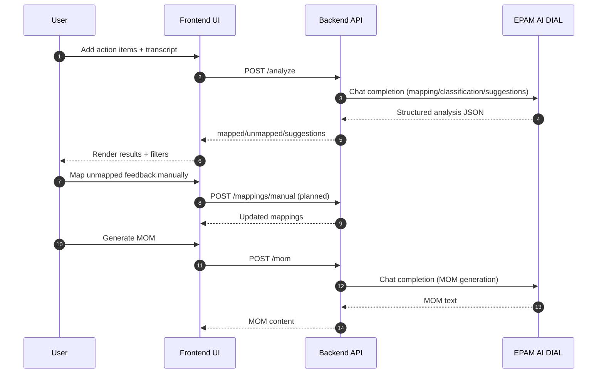

# Architecture

## High-level components
- Frontend Web App
- Backend API (FastAPI)
- EPAM AI DIAL (LLM calls)

## Mermaid Sequence Diagram

## API scope in this starter
- `GET /health`
- `POST /analyze`
- `POST /mom`

## Next scope
- Persistent storage for action items and mappings
- Manual mapping endpoint
- Authentication and role controls
- End-to-end tests and prompt quality evaluation
